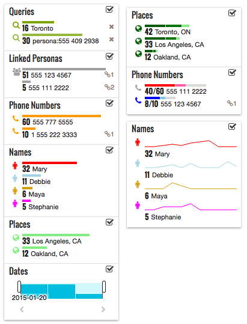
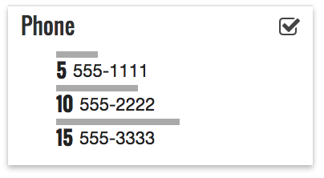

# Facets

> A Javascript UI component for interactive histograms

Facets provides a simple API for displaying histograms that are interactive. Facets is useful for quickly showing the results of Elasticsearch aggregations.




## Usage

    var container = $('#facets-container');
    
    var groups = [{
        label: 'Phone',
        key: 'phone',
        facets : [{
            value: '555-1111',
            count: 5
        }, {
            value: '555-2222',
            count: 10
        }, {
            value: '555-3333',
            count: 15
        }]
    }];
    
    var facets = new Facets(container,groups);
    


## Installation

The visual consumes this checked-in package through an npm `file:` dependency.
From the repository root, install its standalone development tools and build it:

```sh
npm run vendor:install
npm run vendor:build
```

For standalone browser use, load jQuery 4 before `dist/facets.js` or
`dist/facets.min.js`, and include `dist/facets.css`. The bundle exposes
`window.Facets`. A bundler can instead consume the CommonJS `src/main.js` entry.

## Development

This vendored copy is built and tested with a small, dependency-light Node
toolchain (Node `^22.13.0 || >=24`, npm `>=10`). No global build tools or legacy
package manager are required.

For a reproducible standalone install from this directory:

```sh
npm ci --ignore-scripts
```

### Build toolchain: old -> new

| Capability               | Old (removed)                                      | New                                                        |
|---------------------------|-----------------------------------------------------|-------------------------------------------------------------|
| Template precompile        | `gulp-handlebars` + `gulp-define-module`             | `build/compile-templates.js` (plain `Handlebars.precompile`) |
| JS bundle                  | `browserify` + `browserify-shim` + `gulp-concat`/`gulp-order` | `esbuild` (`build/build.js`), IIFE, `window.Facets`   |
| JS minification            | `gulp-uglify`                                        | `esbuild --minify` (`dist/facets.min.js` + sourcemap)        |
| Stylesheet compile/minify  | `gulp-sass` + `gulp-clean-css`                       | `sass` package + `esbuild`'s CSS minifier                    |
| Tests / lifecycle & DOM    | `karma` + `karma-browserify` + PhantomJS/Chrome launcher | `node --test` + `jsdom` (`test/*.test.js`, `test/dom-env.js`) |
| Coverage                   | `karma-coverage` + `browserify-istanbul`             | Node's built-in V8 test coverage (`npm run test:coverage`) |
| Rich-label/link HTML safety | none (raw `{{{triple-stash}}}` output)              | `DOMPurify` bound to the active `window`, exposed as the `{{safeHtml}}` Handlebars helper (see below) |

Scripts (run from this directory):

	npm run compiletemplates   # templates/*.hbs -> src/templates/*.js (Handlebars runtime only)
	npm run build              # compiletemplates + esbuild bundle/minify + sass compile/minify -> dist/
	npm test                   # pretest runs the build, then `node --test test/**/*.test.js`
	npm run test:coverage       # build, tests, and V8 coverage report
	npm audit                  # full dependency tree, no --omit/thresholds/suppressions

`dist/`, `node_modules/` and `.tmp/` are build output and are not committed
(see the repo root `.gitignore`, which already ignores these patterns at any
depth). `package-lock.json` **is** committed so `npm ci` is reproducible.

### jQuery dependency

Source modules do `require('jquery')` explicitly (`jquery` is declared as a
`peerDependency`, `^4.0.0`, matching the version the host PowerBI visual
already uses). Two different resolutions apply depending on how this package
is bundled:

- **Inside the official pbiviz build**: `require('jquery')` resolves normally
  through npm dependencies. Source modules import jQuery explicitly; no custom
  webpack aliases or injected globals are needed. This package does not declare
  a `browser` field that redirects the host build to the standalone shim.
- **Standalone `dist/facets.js` / `dist/facets.min.js` build only**: esbuild
  is configured with an explicit `alias: { jquery: '.../build/jquery-global-shim.js' }`
  (set directly in `build/build.js`'s esbuild options, not via `package.json`).
  The shim reads whatever jQuery instance is already on the page
  (`window.jQuery || window.$`) instead of bundling a second copy - mirroring
  the old `browserify-shim: { jquery: 'global:$' }` behaviour. Consumers of
  the standalone bundle must load jQuery via `<script>` (or otherwise expose
  `window.jQuery`/`window.$`) before this bundle.

### HTML sanitization (`{{safeHtml}}`)

Several templates intentionally allow consumer-supplied markup to be rendered
unescaped - facet/group/badge labels and the facet-placeholder `html` field
support things like `<b>bold</b>` or a hyperlink in a label. These used to be
rendered with Handlebars' raw `{{{triple-stash}}}`, with no sanitization.

They are now routed through a `{{safeHtml value}}` helper (registered in
`src/helpers.js`) that pipes the string through
[DOMPurify](https://github.com/cure53/DOMPurify), bound to this environment's
`window`, and wraps the sanitized result in a `Handlebars.SafeString`. This
removes `<script>`/inline event handler/`javascript:`-`vbscript:`-`data:`-URI
and mutation-XSS/namespace-confusion (SVG/MathML) attack vectors while still
allowing plain formatting tags and safe (`http(s)`/relative/`mailto`) links -
so the existing "rich label"/links feature keeps working. See
`test/selection-and-sanitizer.test.js` for malicious- and safe-input cases.

### Tests

`test/dom-env.js` boots a jsdom `window`/`document` and binds jQuery and
DOMPurify to it (both bind to whatever `window` is globally available the
first time they are `require()`-d, so this must happen before loading any
source module, and the relevant `require.cache` entries are evicted on
teardown so each test file gets a fresh, isolated DOM). `test/fixtures.js`
holds small shared group/facet/histogram fixtures.

- `test/lifecycle.test.js` - initial render, group "more" link, group
  collapse/expand ("less"), `replaceGroup`/`replace`, and `destroy`.
- `test/selection-and-sanitizer.test.js` - `select`/`deselect`, forwarded
  click events, histogram filter-range reads/changes
  (`facet-histogram:rangechangeduser`), and the `{{safeHtml}}` sanitizer
  (malicious payloads neutralized, safe formatting/links preserved).
- `test/dist-and-jquery4.test.js` - loads the built `dist/facets.js` IIFE
  bundle with only a global jQuery present (as a real consumer would), checks
  it exposes `window.Facets` and fails fast with a clear error without one;
  also asserts no jQuery-4-removed API (`$.isFunction`, `$.isNumeric`,
  `$.isArray`, `$.parseJSON`, `$.trim`, `.size()`) is used anywhere in `src/**`.


## Run tests

	npm --prefix lib/@uncharted.software/stories-facets test
